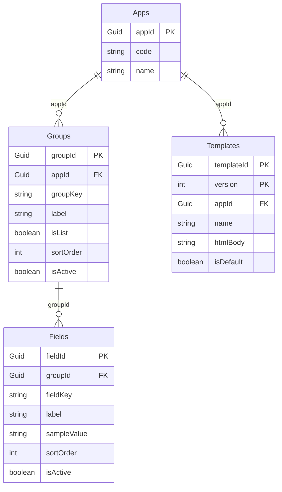

# Struttura dei dati del service Template

Fonte: il metadata del service OData V4 `TemplateService` (`/odata/v4/Template/`), copia locale in
`cel-cards/webapp/localService/Template/metadata.xml`. Descrive il **modello esposto dal service**: i tipi e i
vincoli sono quelli dichiarati nel metadata, non sono verificati sul DDL delle tabelle HANA.

## Relazioni



Tutte le entità hanno anche i campi di audit `createdAt`, `createdBy`, `modifiedAt`, `modifiedBy` (calcolati dal server, non modificabili). La libreria non li legge.

## Apps

Le applicazioni che usano i template (es. le Schede CEL).

| Campo | Tipo | Note |
|---|---|---|
| `appId` | Guid, **chiave** | Generato dal server. |
| `code` | String(100), obbligatorio | Codice leggibile, es. `SCHEDE_CEL`. È l'identificativo che le app passano alla libreria. |
| `name` | String(200), obbligatorio | Nome descrittivo. |

## Groups

Raggruppano i campi nel catalogo. Un gruppo può essere un insieme di campi singoli o un **elenco** (tabella).

| Campo | Tipo | Note |
|---|---|---|
| `groupId` | Guid, **chiave** | Generato dal server. |
| `appId` | Guid, obbligatorio | Navigazione `app` → `Apps`. |
| `groupKey` | String(100), obbligatorio | Chiave tecnica. Per un elenco è il nome usato in `{{#each groupKey}}` e come proprietà dell'array nei dati. |
| `label` | String(200), obbligatorio | Etichetta mostrata nella lista dei campi dell'editor. |
| `isList` | Boolean, obbligatorio | `true`: i campi del gruppo sono le colonne di un elenco ripetibile; `false`: campi singoli. |
| `sortOrder` | Int32, obbligatorio | Ordine di visualizzazione. |
| `isActive` | Boolean, obbligatorio | La libreria legge solo i gruppi attivi. |

## Fields

I campi inseribili nel template. Non hanno `appId`: l'app si ricava dal gruppo.

| Campo | Tipo | Note |
|---|---|---|
| `fieldId` | Guid, **chiave** | Generato dal server. |
| `groupId` | Guid, obbligatorio | Navigazione `group` → `Groups`. |
| `fieldKey` | String(100), obbligatorio | Nome del segnaposto: `{{fieldKey}}`. |
| `label` | String(200), obbligatorio | Etichetta nell'editor. |
| `sampleValue` | String(500), facoltativo | Valore d'esempio **già formattato** per l'anteprima. Per i campi di un elenco contiene un valore per riga separati da `;` (es. `Rossi Srl; Bianchi SpA; Verdi Snc` genera tre righe d'esempio). |
| `sortOrder` | Int32, obbligatorio | Ordine dentro il gruppo. |
| `isActive` | Boolean, obbligatorio | La libreria legge solo i campi attivi. |

## Templates

Una riga per ogni **versione** di un template. Una modifica non sovrascrive: aggiunge una versione.

| Campo | Tipo | Note |
|---|---|---|
| `templateId` | Guid, **chiave** (1/2) | Identifica il template; tutte le sue versioni lo condividono. |
| `version` | Int32, **chiave** (2/2) | Numero di versione. |
| `appId` | Guid, obbligatorio | Navigazione `app` → `Apps`. |
| `name` | String(200), obbligatorio | Nome del template. |
| `htmlBody` | String, obbligatorio | HTML scritto nell'editor, con i segnaposto. |
| `isDefault` | Boolean, obbligatorio | Template usato per generare i documenti dell'app. |

## Operazioni

| Operazione | Parametri | Restituisce | Uso nella libreria |
|---|---|---|---|
| Funzione `getDefaultTemplate` | `appId` (Guid, facoltativo), `appCode` (String, facoltativo) | `Templates` | La libreria passa `appCode`. Restituisce il template di default dell'app; se non ce n'è nessuno la libreria tratta il 404 come «nessun template». |
| Azione `saveTemplate` | `appId` (Guid), `templateId` (Guid), `name`, `htmlBody`, `isDefault` | `Templates` | La libreria passa `appId` (ricavato dal codice), il `templateId` del template di default se esiste, nome e HTML, `isDefault = true`. |

## Come la libreria legge i dati

1. `Apps` filtrata per `code` → `appId`.
2. `Groups` con `appId = …` e `isActive = true`, ordinati per `sortOrder`.
3. `Fields` con `group/appId = …` e `isActive = true`, ordinati per `sortOrder`.
4. Il motore costruisce:
   - i **campi singoli** (gruppi con `isList = false`) → segnaposto `{{fieldKey}}`;
   - gli **elenchi** (gruppi con `isList = true`) → `{{#each groupKey}}` con i `fieldKey` come colonne;
   - i **dati d'esempio** dai `sampleValue`.

## Struttura necessaria perché la libreria funzioni

Quattro tabelle e due operazioni. Qui sotto il modello CAP (CDS) equivalente al metadata; i nomi di entità e proprietà
devono restare questi (chiavi comprese: `appId`, `groupId`, `fieldId`, non `ID`), perché la libreria li usa nelle query.

```cds
using { managed } from '@sap/cds/common';

entity Apps : managed {
  key appId : UUID;
  code      : String(100) not null;    // univoco: è l'identificativo usato dalle app
  name      : String(200) not null;
}

entity Groups : managed {
  key groupId : UUID;
  app       : Association to Apps not null;   // → appId
  groupKey  : String(100) not null;
  label     : String(200) not null;
  isList    : Boolean not null default false;
  sortOrder : Integer not null;
  isActive  : Boolean not null default true;
}

entity Fields : managed {
  key fieldId : UUID;
  group       : Association to Groups not null;  // → groupId
  fieldKey    : String(100) not null;
  label       : String(200) not null;
  sampleValue : String(500);
  sortOrder   : Integer not null;
  isActive    : Boolean not null default true;
}

entity Templates : managed {
  key templateId : UUID;
  key version    : Integer;
  app            : Association to Apps not null;   // → appId
  name           : String(200) not null;
  htmlBody       : LargeString not null;           // HTML dell'editor, può superare i 5000 caratteri
  isDefault      : Boolean not null default false;
}

service TemplateService {
  entity Apps      as projection on db.Apps;
  entity Groups    as projection on db.Groups;
  entity Fields    as projection on db.Fields;
  entity Templates as projection on db.Templates;

  action   saveTemplate(appId: UUID, templateId: UUID, name: String(200), htmlBody: LargeString, isDefault: Boolean) returns Templates;
  function getDefaultTemplate(appId: UUID, appCode: String(100)) returns Templates;
}
```

### Vincoli da garantire (la libreria non li verifica)

| Vincolo | Perché |
|---|---|
| `Apps.code` **univoco** | La libreria prende la prima app trovata con quel codice. |
| `(Groups.app, Groups.groupKey)` **univoco** | `groupKey` è il nome dell'elenco in `{{#each groupKey}}` e nei dati: due gruppi con la stessa chiave si confondono. |
| `(Fields.group, Fields.fieldKey)` univoco, e **`fieldKey` univoco tra tutti i campi singoli dell'app** | Tutti i campi singoli vivono nello stesso spazio di nomi del template (`{{fieldKey}}`). Nei gruppi elenco i `fieldKey` sono le colonne di quell'elenco e possono ripetersi tra elenchi diversi. |
| `fieldKey` e `groupKey` solo lettere, cifre e `_` (`\w+`) | Il motore riconosce i segnaposto con `[\w.]+` e gli elenchi con `\w+`: altri caratteri non vengono sostituiti. |
| `sortOrder` valorizzato | Gruppi e campi vengono ordinati per questo valore; a parità l'ordine non è garantito. |
| Per ogni `(app, templateId)`: **un solo `isDefault = true`** e `version` crescente da 1 | `getDefaultTemplate` deve restituire la versione di default; la libreria si aspetta che sia la più recente salvata. |
| Gruppi e campi disattivati con `isActive = false`, non cancellati | La libreria legge solo gli attivi; i template salvati che li usano restano leggibili. |

### Cosa deve fare il server

- `saveTemplate` senza `templateId` crea un nuovo template (versione 1); con `templateId` aggiunge la versione successiva **senza modificare le precedenti**, imposta la nuova come default e toglie il default alle altre versioni dello stesso template.
- `getDefaultTemplate(appCode)` risolve l'app dal codice e restituisce il template di default con la versione più alta; se non esiste risponde con 404 o con risposta vuota.
- I campi di audit (`createdAt`, `createdBy`, `modifiedAt`, `modifiedBy`) li valorizza il server.
- Autorizzazioni: lettura di `Apps`, `Groups`, `Fields` e chiamata a `getDefaultTemplate` per chi genera i documenti; `saveTemplate` solo per chi può modificare i template.

### Dati di partenza minimi per un'app

Senza questi la libreria non mostra campi e non produce nulla da inserire nel template.

| Tabella | Riga d'esempio |
|---|---|
| `Apps` | `code = SCHEDE_CEL`, `name = Schede CEL` |
| `Groups` | `groupKey = datiGenerali`, `label = Dati generali`, `isList = false`, `sortOrder = 1`, `isActive = true` |
| `Groups` | `groupKey = affidatari`, `label = Affidatari`, `isList = true`, `sortOrder = 2`, `isActive = true` |
| `Fields` (gruppo `datiGenerali`) | `fieldKey = protocollo`, `label = Protocollo`, `sampleValue = CEL/2026/0142`, `sortOrder = 1` |
| `Fields` (gruppo `affidatari`) | `fieldKey = ragioneSociale`, `label = Ragione sociale`, `sampleValue = Rossi Srl; Bianchi SpA; Verdi Snc`, `sortOrder = 1` |
| `Fields` (gruppo `affidatari`) | `fieldKey = quota`, `label = Quota`, `sampleValue = 50%; 30%; 20%`, `sortOrder = 2` |

I campi di un elenco devono avere **lo stesso numero di valori** in `sampleValue` (qui tre), altrimenti le righe d'esempio risultano incomplete.
Con questi dati il template può contenere `{{protocollo}}` e una riga di tabella con `{{#each affidatari}}`, `{{ragioneSociale}}` e `{{quota}}`.

I `Templates` non vanno inseriti a mano: nascono dal primo `saveTemplate`.

## Da verificare con chi gestisce il service

- Che `saveTemplate` assegni la `version` (la libreria non la invia) e imposti come default la nuova versione.
- Cosa succede a `isDefault` delle versioni precedenti dello stesso template.
- Se `getDefaultTemplate` risponde 404 o vuoto quando non esiste nessun template.
- Se `Fields` accetta il filtro `group/appId` (altrimenti si filtra per i `groupId` letti).
